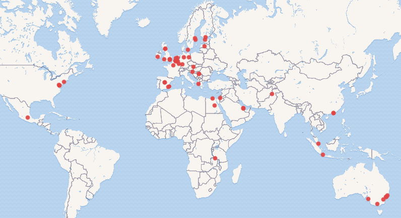

# Reutilizando colecciones digitales: GLAM Labs

## Objetivos de la lección
Esta lección muestra cómo reutilizar colecciones digitales publicadas por instituciones de patrimonio cultural y tiene como objetivos pricipales los siguientes:

* Conocer qué es un Lab en el marco de una institución GLAM
* Reutilizar de forma innovadora y creativa colecciones digitales
* Enriquecer los datos a través de diferentes técnicas

## Antes de comenzar

Las instituciones de patrimonio cultural han comenzado a experimentar con las colecciones digitales que tradicionalmente han publicado en formato digital. Este nuevo contexto ha favorecido la creación de nuevos espacios en el seno de las instituciones para experimentar con las colecciones digitales de forma creativa e innovadora conocidos como Labs. Uno de los primeros Labs, y líder en este ámbito sentando las bases para el resto, corresponde al de la [Biblioteca Británica](http://labs.bl.uk) que ha sido financiado por la [Mellon Foundation](https://mellon.org/). Como resultado a dos reuniones de carácter internacional en la sede de la Biblioteca Británica y en la Biblioteca Real de Dinamarca en Copenhague, se creó la [Comunidad Internacional GLAM Labs](https://glamlabs.io) compuesta por numerosas instituciones como se muestra en la siguiente figura. 





En septiembre de 2019, 16 personas pertenecientes a dicha comunidad se reunieron en Doha para escribir a partir de la metodología Book Sprint el libro [Open a GLAM Lab](https://glamlabs.io/books/open-a-glam-lab/) que actualmente ha sido traducido a diversos idiomas, entre ellos castellano y árabe.

## Prerequisitos

En esta lección asumimos que tienes cierto conocimiento sobre Python. Saber otro lenguaje de programación también te será útil. Si necesitas un lugar donde empezar, recomendamos trabajar con los excelentes tutoriales sobre [Python](https://programminghistorian.org/es/lecciones/?topic=python) en *The Programming Historian en español*. También necesitarás conocimientos sobre Jupyter Notebooks y para ello te recomendamos la lección de [Jupyter Notebooks](https://programminghistorian.org/en/lessons/jupyter-notebooks). Además, será necesario tener pequeños conocimientos sobre Linked Open Data y SPARQL para los ejemplos de reutilización y te será útil la lección de [datos abiertos enlazados](https://programminghistorian.org/es/lecciones/introduccion-datos-abiertos-enlazados).


## Introducción

Tradicionalmente las instituciones de patrimonio de cultural conocidas como GLAM (del inglés, Galleries, Libraries, Museums and Archives) han publicado colecciones digitales que incluían todo tipo de materiales con el objetivo de facilitar el acceso a la información a la sociedad.
El avance de las tecnologías ha favorecido un nuevo contexto en el que las colecciones digitales pueden ser aplicadas en investigación por medio de diferentes métodos como visión por computador o técnicas de aprendizaje automático. Actualmente, las instituciones GLAM intentan promover e incentivar la reutilización de sus colecciones digitales a través de programas de colaboración directamente con investigadores pero también con empresas e instituciones académicas.

A la hora de reutilizar una colección digital existen diferentes aspectos que deben ser tenido en cuenta como por ejemplo la licencia o el tipo de material. Las instituciones han comenzado a utilizar licencias abiertas, pero en algunos casos la licencia no es evidente impidiendo su reutilización. Dependiendo del método de investigación a aplicar será necesario un tipo específico de material. Por ejemplo, si deseamos realizar renocimiento de formas necesitaremos un repositorio que se base en imágenes.

Recientemente se publicó el estudio [Collections as data](https://collectionsasdata.github.io/) que proporciona un nuevo enfoque para publicar las colecciones digitales que facilitan el procesamiento por parte de las computadoras. Por ejemplo, un investigador puede utilizar un corpus de miles de textos para identificar personas o lugares de forma automática. Las computadoras permiten la aplicación de métodos de investigación en Humanidades Digitales como text mining, visualización de datos o el uso de sistemas de información geográfica (GIS) como también procesamiento del lenguaje natural, inteligencia artificial y visión por computador. 

La combinación de las colecciones digitales proporcionadas por las instituciones GLAM junto a código y narrativa proporciona el marco ideal para la reproducción de los resultados de investigación.
En este sentido, los jupyter notebooks permiten integrar los tres elementos y se han convertido en un elemento muy popular tanto en la comunidad investigadora como en la educativa. Numerosos proyectos se centran en la publicación de colecciones de notebooks como por ejemplo [GLAM Workbench](https://glam-workbench.github.io/) o [GLAM Jupyter Notebooks](http://data.cervantesvirtual.com/blog/notebooks/). Los Labs favorecen un espacio para poner de manifiesto estas nuevas tendencias para mejorar y mantener la relevancia de las instituciones de patrimonio cultural. 


## Buscando colecciones digitales para su reutilización
Actualmente existen numerosos sitios web donde localizar colecciones digitales para su reutilización. Muchos de ellos corresponden al espacio Lab dentro de la institución GLAM. En otros casos, la colección digital se puede localizar en plataformas como Zenodo que permite la publicación de datasets. La siguiente tabla proporciona un resumen de instituciones GLAM donde localizar colecciones digitales con licencias abiertas para su reutilización.

| Institución   | Colección | URL |
| ------------- | ------------- | ------------- |
| Bibliotèque nationale de France | BnF API et jeux de données | http://api.bnf.fr/ | 
| British Library | data.bl.uk | https://data.bl.uk/ | 
| Biblioteca Virtual Miguel de Cervantes | BVMC Labs | http://data.cervantesvirtual.com/blog/labs | 
| Det Kgl. Bibliotek | KB Labs | https://labs.kb.dk/ | 
| Europeana | Europeana IIIF APIs | https://pro.europeana.eu/page/iiif | 
| History Trust of South Australia | Learn section | https://history.sa.gov.au/ | 
| National Library of Netherlands | KB Lab | https://lab.kb.nl/ |
| National Library of Scotland | Data Foundry | https://data.nls.uk/ |
| Library of Congress | LC for Robots | https://labs.loc.gov/lc-for-robots/ |
| Österreichische Nationalbibliothek | ONB Labs |https://labs.onb.ac.at/en/|
| Staatsbibliothek zu Berlin | SBB Labs | https://lab.sbb.berlin/?lang=en|
| State Library New South Wales | DX Lab | https://dxlab.sl.nsw.gov.au|

Las instituciones GLAM publican colecciones digitales en diferentes formatos y materiales. Tradicionalmente han publicado diversos tipos de materiales como imágenes, textos y mapas. Recientemente, nuevas formas de publicación han aparecido que utilizan tecnologías basadas en la Web Semántica. Estas técnicas permiten el enriquecimiento con repositorios externos de a partir de la creación de enlaces. [Wikidata](https://www.wikidata.org) se ha convertido en un repositorio muy popular en el ámbito de las instituciones GLAM y muchas de ellas ya disponen de propiedades específicas para enlazar sus resursos como por ejemplo autores y obras. Por ejemplo, la [Biblioteca Virtual Miguel de Cervantes](http://www.cervantesvirtual.com/) dispone de la propiedad [P2799](https://www.wikidata.org/wiki/Property:P2799) para enlazar autores desde su repositorio de datos abiertos hacia Wikidata.


## Ejemplo 1: Creación de mapas a partir de Linked Open Data 
Para e


## Ejemplo 2: Extracción y visualización de datos
Para el segundo ejemplo vamos a utilizar la colección [Moving Image Catalogue](https://data.nls.uk/data/metadata-collections/moving-image-archive/) del Data Foundry de la [Biblioteca Nacional de Escocia](https://data.nls.uk/). Esta colección consiste en ficheros que contienen metadatos descritos con [MARCXML](https://www.loc.gov/standards/marcxml//). Si nos fijamos en la web de descarga, es posible identificar que la colección está publicada bajo dominio público y por tanto no tiene restricciones de uso.

En primer lugar, importamos las librerías que vamos a necesitar para trabajar con la colección. Básicamente necesitamos un conjunto de librerías para trabajar con MARC, CSV, expressiones regulares, visualización y empaquetado de datos.

```python
# importamos las librerías
# https://pypi.org/project/pymarc/
import pymarc, re, csv
import pandas as pd
from pymarc import parse_xml_to_array
from datapackage import Package
```


## Conclusiones
El futuro de los Labs es esperanzador en lo que respecta a la mejora y adaptación de las instituciones de patrimonio cultural a los nuevos desarrollos tecnológicos, donde la inteligencia artificial va a jugar un papel crucial y las instituciones GLAM pueden servir como repositorio de datos para alimentar los procesos de entrenamiento. Las instituciones GLAM necesitan adaptar sus flujos de trabajo para incluir nuevos aspectos que todavía no han terminado de encajar por diversos motivos, ya sean económicos o de conocimientos técnicos, pero que resultarán fundamentales en los próximos años.

En el contexto iberoamericano, los Labs facilitarán sin duda el desarrollo y evolución de las instituciones de patrimonio cultural proporcionando sus colecciones para diferentes fines. Además, permitirá a las instituciones mantener su estatus original y permanecer relevantes, adoptando en sus flujos de trabajo tareas que faciliten la investigación y la reutilización.


